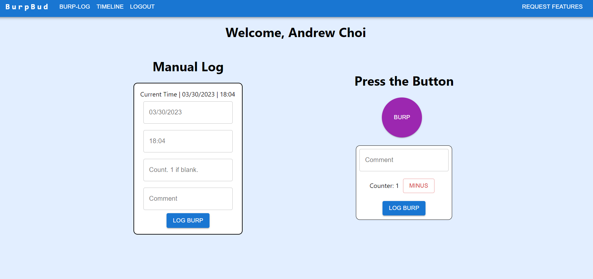
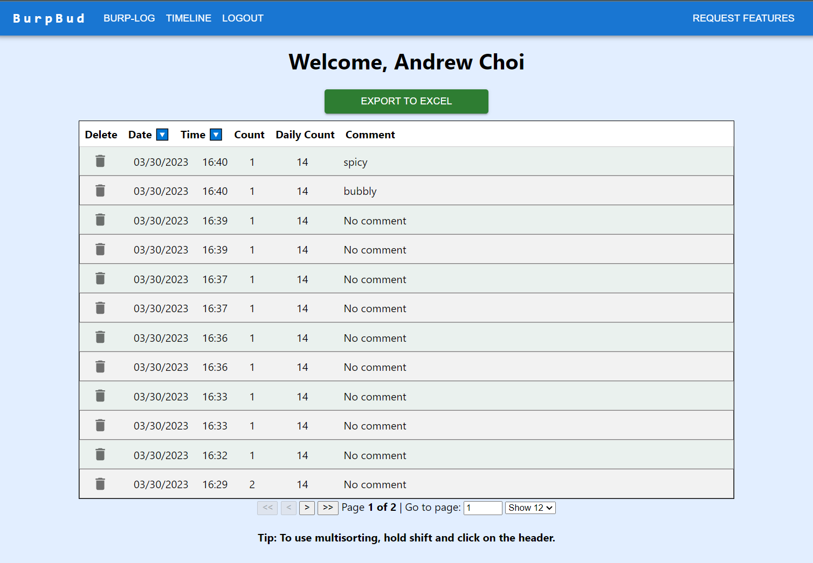
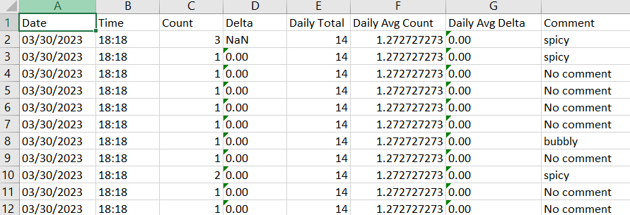
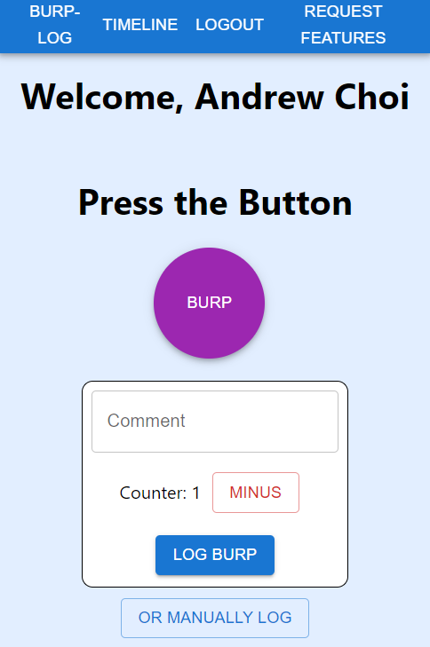

<div id="top"></div>

[![Contributors][contributors-shield]][contributors-url]

[![MIT License][license-shield]][license-url]

<div>
<h2 align="center">Burp Bud</h2>
<p align="center">
    A friend with gastropareisis said he needed a way to track his symptoms as per the request of his gastroentologist. 
    He was manually logging each time his eructations, or burps, would come up- which came up to almost 100 logs per day.
    Because this was so time consuming, he asked me if I could make him "a button." 
    So that is exactly what I did and added extra features!
    <br />
    <a href="https://github.com/WhaleAnchor/BurpBud"><strong> Go to the GitHub Repository »</strong></a>
    <br />
    <br />
    <a href="https://burpbud.onrender.com/">Deployed on Render</a>
    ·
    <a href="https://github.com/WhaleAnchor/BurpBud/issues">Report Bug</a>
    ·
    <a href="https://github.com/WhaleAnchor/BurpBud/issues">Request Feature</a>
  </p>
</div>

## Table of Contents

<li><a href="#about-the-project">About the Project</a></li>
<li><a href="#built-with">Built With</a></li>
<li><a href="#installation">Installation</a></li>
<li><a href="#usage">Usage</a></li>
<li><a href="#license">License</a></li>
<li><a href="#contact">Contact</a></li>

## About The Project


This is a custom logging single-page-application using React that is designed to solve the common problem of time-consuming logs. 
* The UI is designed differently for mobile for easier access and use!
* The app utilizes Firebase to provide a cloud-based database, which can be accessed by all users of the app, providing real-time updates.
* With user authentication options, including email/password or Google account, users can see their own data. 
* The database can be downloaded to an excel spreadsheet for closer access to the data.
* The excel spreadsheet provides more information such as daily averages and deltas between each log.
* The deployed link is on Render! Feel free to sign up and start logging away!

 

 

 

 


Here is a link to the repo: <a href="https://github.com/WhaleAnchor/BurpBud">Burp Bud</a>

<p align="right">(<a href="#top">back to top</a>)</p>

### Built With

[![React][react-shield]][react-url]

[![NodeJS][nodejs-shield]][nodejs-url]

[![Firebase][firebase-shield]][firebase-url]

[![Materialui][materialui-shield]][materialui-url]

[![Reacttable][reacttable-shield]][reacttable-url]

[![Excel][excel-shield]][excel-url]

<p align="right">(<a href="#top">back to top</a>)</p>

## Installation

1. Clone the repo.
    ```sh
    git clone git@github.com:WhaleAnchor/BurpBud.git
    ```
2. Download the dependencies.
   ```sh
    npm i
   ```
3. Run the locally.
    ```sh
    npm run start
    ```
4. Make an account.
    ```sh
    Register using email/password or with your Google account.
    ```

<p align="right">(<a href="#top">back to top</a>)</p>

## Usage

If you want to try using the website:

1. Head over to the deployed website on Render!
   ```sh
   https://burpbud.onrender.com/
   ```

<p align="right">(<a href="#top">back to top</a>)</p>

## License

Distributed under the MIT License.

<p align="right">(<a href="#top">back to top</a>)</p>

## Contact

Andrew Choi - https://github.com/WhaleAnchor/BurpBud

Project Link: [https://github.com/WhaleAnchor/BurpBud](https://github.com/WhaleAnchor/BurpBud)

<p align="right">(<a href="#top">back to top</a>)</p>

<!-- Markdown links -->
[contributors-shield]:https://img.shields.io/github/contributors/WhaleAnchor/BurpBud.svg?style=for-the-badge
[contributors-url]:https://github.com/WhaleAnchor/BurpBud/graphs/contributors

[license-shield]:https://img.shields.io/github/license/othneildrew/Best-README-Template.svg?style=for-the-badge
[license-url]:https://github.com/othneildrew/Best-README-Template/blob/master/LICENSE.txt

[react-shield]:https://img.shields.io/badge/React-20232A?style=for-the-badge&logo=react&logoColor=61DAFB
[react-url]:https://react.dev/reference/react

[nodejs-shield]:https://img.shields.io/badge/Node.js-339933?style=for-the-badge&logo=nodedotjs&logoColor=white
[nodejs-url]: https://nodejs.org/en/

[firebase-shield]:https://img.shields.io/badge/firebase-ffca28?style=for-the-badge&logo=firebase&logoColor=black
[firebase-url]:https://firebase.google.com/docs

[materialui-shield]:https://img.shields.io/badge/Material%20UI-007FFF?style=for-the-badge&logo=mui&logoColor=white
[materialui-url]:https://mui.com/material-ui/getting-started/overview/

[reacttable-shield]:https://img.shields.io/badge/react%20table-FF4154?style=for-the-badge&logo=react%20table&logoColor=white
[reacttable-url]:https://react-table-v7.tanstack.com/

[excel-shield]:https://img.shields.io/badge/Microsoft_Excel-217346?style=for-the-badge&logo=microsoft-excel&logoColor=white
[excel-url]:https://www.npmjs.com/package/excel-api


